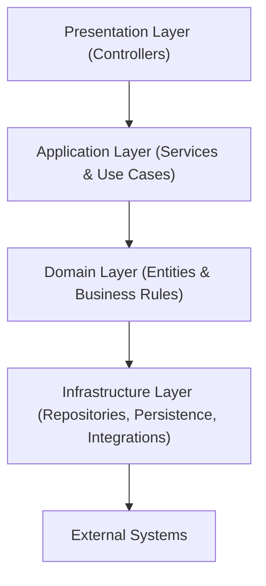

# E-Commerce-API-V1

[](https://github.com/omargamal1121/E-Commerce-API-V1/actions)
[](LICENSE)
[](#technologies)

A robust, modular, and extensible API for e-commerce platforms built using **C# (.NET Core)**.  
This repository provides scalable solutions for managing products, categories, inventories, carts, orders, payment integrations, and more. It leverages **Clean Architecture** for maintainability and high-quality engineering—making it ideal for modern businesses and teams focused on growth and reliability.

---

## Table of Contents

- [Features](#features)
- [Badges & Tech Stack](#badges--tech-stack)
- [Architecture Diagram](#architecture-diagram)
- [Modules Overview](#modules-overview)
- [Getting Started](#getting-started)
- [API Documentation](#api-documentation)
- [Example API Requests](#example-api-requests)
- [CI/CD & Deployment](#cicd--deployment)
- [Clean Architecture](#clean-architecture)
- [SOLID Principles](#solid-principles)
- [Testing](#testing)
- [Contributing](#contributing)
- [License](#license)
- [Author](#author)

---

## Features

- Efficient **Generic Repository Pattern** for CRUD, soft delete, restore, batch updates.
- **Category & Subcategory Management:** Status toggling, image checking, product relationships.
- **Shopping Cart System:** User-centric, supports add/remove/clear/count.
- **Payment Integration:** Easily connect and manage payment gateways.
- **Order Services:** Place, update, and track orders; extendable service architecture.
- **Redis Caching** for performance and scalability.
- **Entity Soft Delete & Restore:** Data integrity by reversible deletes.
- **Structured Logging** for debugging and operational clarity.
- Adheres strictly to **SOLID** and **Clean Architecture** principles for reliability.

---

## Badges & Tech Stack

- Build: [](https://github.com/omargamal1121/E-Commerce-API-V1/actions)
- License: [](LICENSE)
- Tech Stack: [](#technologies)

**Primary Technologies:**
- **Language:** C#
- **Database:** MySQL via Entity Framework Core
- **Cache:** Redis
- **Other:** Dapper, StackExchange.Redis, Microsoft.Extensions.Logging, Newtonsoft.Json
- **Containerization:** Docker

---

## Architecture Diagram

> **Note:**  
> The diagram below uses simple text labels without HTML tags and is compatible with GitHub's Mermaid renderer. If it does not render, use [Mermaid Live Editor](https://mermaid-js.github.io/mermaid-live-editor/).



---

## Modules Overview

| Module           | Description                                                                                  |
|------------------|---------------------------------------------------------------------------------------------|
| **Domain**       | Contains business models and core rules, representing products, users, categories, etc.     |
| **Application**  | Defines service interfaces, use cases, data transfer objects, and orchestrates workflows.    |
| **Infrastructure** | Handles data persistence, repository implementation, payment APIs, and cache strategies.   |
| **Presentation** | Hosts API controllers/endpoints, managing HTTP requests and responses via RESTful patterns.  |

---

## Getting Started

### Prerequisites

- .NET SDK (latest stable)
- MySQL database
- Redis server
- Docker (recommended for full stack setup)

### Local Development Setup

1. **Clone the repository**
   ```bash
   git clone https://github.com/omargamal1121/E-Commerce-API-V1.git
   cd E-Commerce-API-V1
   ```

2. **Configure environment**
   - Update `appsettings.json` with your MySQL and Redis details.
   - Optionally, set environment variables as needed.

3. **Restore & Build**
   ```bash
   dotnet restore
   dotnet build
   ```

4. **Database Migration**
   ```bash
   dotnet ef database update
   ```
   > Make sure [dotnet-ef](https://docs.microsoft.com/en-us/ef/core/cli/dotnet) is installed:  
   > `dotnet tool install --global dotnet-ef`

5. **Run Locally**
   ```bash
   dotnet run --project src/Presentation
   ```
   API will be accessible at [http://localhost:5000/swagger](http://localhost:5000/swagger).

### Docker Setup

1. **Build Docker Image**
   ```bash
   docker build -t ecommerce-api .
   ```

2. **Run with Docker**
   ```bash
   docker run -p 5000:80 ecommerce-api
   ```
   > Ensure MySQL and Redis are accessible to the container (using Docker Compose is recommended for local stack).

---

## API Documentation

Explore the API endpoints interactively:

- **Local:** [http://localhost:5000/swagger](http://localhost:5000/swagger)
- **Hosted:** [Live Swagger UI](https://e-commerce-api-v1-p515.onrender.com/swagger/index.html)

---

## Example API Requests

#### Add a Product

```bash
curl -X POST "http://localhost:5000/api/products" \
     -H "Content-Type: application/json" \
     -d '{
           "name": "New Product",
           "price": 49.99,
           "categoryId": 1,
           "description": "A sample product"
         }'
```
**Sample Response**
```json
{
  "id": 123,
  "name": "New Product",
  "price": 49.99,
  "categoryId": 1,
  "description": "A sample product",
  "createdAt": "2025-09-01T12:00:00Z"
}
```

#### Get a Product

```bash
curl "http://localhost:5000/api/products/123"
```
**Sample Response**
```json
{
  "id": 123,
  "name": "New Product",
  "price": 49.99,
  "categoryId": 1,
  "description": "A sample product",
  "createdAt": "2025-09-01T12:00:00Z"
}
```

---

## CI/CD & Deployment

- **CI:** GitHub Actions validates commits with build & test workflows.
- **CD:** Deployment can leverage staging environments and blue/green strategies for zero-downtime upgrades.
- **Safety:** All changes go through automated tests; production releases require approval to minimize risk.

**Example Workflow:**
- PR opened → Build/Test → Deployed to Staging (auto/preview)
- Manual approval → Blue/Green deployment → Traffic switched to new release after health checks

---

## Clean Architecture

> Decoupling for Scale & Quality

The project is organized into four distinct layers:

- **Domain:** Core business logic, entities, and rules.
- **Application:** Application workflows, services, use case orchestration.
- **Infrastructure:** Data access, external integrations, and technical details.
- **Presentation:** Web API controllers and HTTP endpoints.

**Benefits:** Testable code, easy maintenance, flexible technology adoption, and clear separation of concerns.

---

## SOLID Principles

The entire codebase is structured with SOLID in mind:
- **S:** Each class or module has a single responsibility.
- **O:** All entities are open for extension, closed for modification.
- **L:** Subtypes substitute their base types without breaking logic.
- **I:** Interfaces segregated for focused implementation.
- **D:** High-level logic is built on abstractions, not concrete classes.

---

## Testing

The solution is ready for unit and integration tests via xUnit or NUnit.  
Coverage of business rules, data access, and controller contracts is recommended for quality assurance.

---

## Contributing

Contributions, suggestions, and bug reports are always welcome!  
Fork the repo, open issues, or submit pull requests.  
See [CONTRIBUTING.md](CONTRIBUTING.md) for guidelines.

---

## License

MIT License

```
MIT License

Copyright (c) 2025 omargamal1121

Permission is hereby granted, free of charge, to any person obtaining a copy
of this software and associated documentation files (the "Software"), to deal
in the Software without restriction, including without limitation the rights
to use, copy, modify, merge, publish, distribute, sublicense, and/or sell
copies of the Software, and to permit persons to whom the Software is
furnished to do so, subject to the following conditions:

The above copyright notice and this permission notice shall be included in all
copies or substantial portions of the Software.

THE SOFTWARE IS PROVIDED "AS IS", WITHOUT WARRANTY OF ANY KIND, EXPRESS OR
IMPLIED, INCLUDING BUT NOT LIMITED TO THE WARRANTIES OF MERCHANTABILITY,
FITNESS FOR A PARTICULAR PURPOSE AND NONINFRINGEMENT. IN NO EVENT SHALL THE
AUTHORS OR COPYRIGHT HOLDERS BE LIABLE FOR ANY CLAIM, DAMAGES OR OTHER
LIABILITY, WHETHER IN AN ACTION OF CONTRACT, TORT OR OTHERWISE, ARISING FROM,
OUT OF OR IN CONNECTION WITH THE SOFTWARE OR THE USE OR OTHER DEALINGS IN THE
SOFTWARE.
```

---

## Author

- **Omar Gamal**
  - [GitHub](https://github.com/omargamal1121)
  - [LinkedIn](https://www.linkedin.com/in/omar-gamal-2a55812b5/)

---

> For details, see source code, documentation, or reach out via issues.  